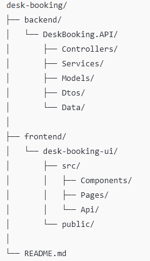

# 🪑 Desk Booking

A simple desk booking web application that allows users to view desk availability, reserve desks for a specific day, and manage their reservations.

This project was built to focus on **clean logic**, **simple UI**, and **clear separation between frontend and backend**.

## ✨ Features

### 👤 User Simulation
- Switch between users
- No authentication yet

### 🪑 Desk Management
- View all desks
- Desk statuses:
  - Open
  - Reserved
  - Maintenance
- Maintenance desks show a message and cannot be reserved

### 📅 Daily Reservations
- Select a single day
- Reserve a desk for that day
- Cancel your own reservation
- Optional access code support

### 👤 Profile Page
- View current user
- See:
  - Current reservations
  - Past reservations

## 🛠 Tech Stack

### Backend
- **ASP.NET Core**
- **Entity Framework Core**
- **InMemory database**
- REST API

### Frontend
- **React**
- **Vite**
- **Tailwind CSS**
- **React Router**

## 📁 Project Structure



## ▶️ How to Run the Project

### Backend
```bash
cd backend/DeskBooking.API
dotnet run
```

Backend will run on: http://localhost:5000
(or the port shown in terminal)


### Frontend
```bash
cd frontend/desk-booking-ui
npm install
npm run dev
```

Backend will run on: http://localhost:5000
(or the port shown in terminal)
